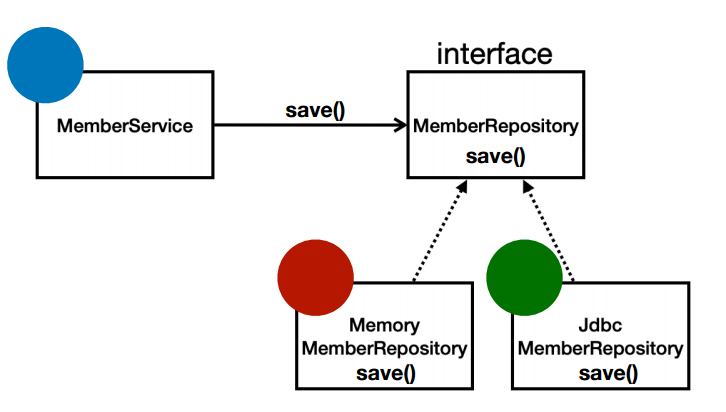

# 스프링의 핵심
- 스프링은 자바 언어 기반의 프레임워크인데, 자바 언어의 가장 큰 특징은 객체 지향 언어라는 점.
- 스프링은 객체 지향 언어가 가진 강력한 특징을 살려내는 프레임워크. -> 이는 좋은 객체 지향 애플리케이션을 개발할 수 있게 도와준다.

# 객체 지향 특징
- 추상화
- 캡슐화
- 상속
- **다형성**  

객체 지향 프로그래밍의 특징중 다형성이 스프링을 다룰 때 가장 핵심포인트

# 객체 지향 설계와 스프링
## 역할과 구현을 분리
- 역할과 구현으로 구분하면 세상이 단순해지고, 유연해지며 변경도 편리해진다.
- 장점
  - 클라이언트는 대상의 역할(인터페이스)만 알면 된다.
  - 클라이언트는 구현 대상의 내부 구조를 몰라도 된다.
  - 클라이언트는 구현 대상의 내부 구조가 변경되어도 영향을 받지 않는다.
  - 클라이언트는 구현 대상 자체를 변경해도 영향을 받지 않는다.

 

스프링과 객체지향 설계의 관계에서 다형성이 가장 중요함.
MemberRepository 인터페이스에게 상속받은 JdbcMemberRepository, JpaMemberRepository, MemoryMemberRepository 등
 여러 구현체를 클라이언트가 아무런 영향을 받지 않고도 구현체를 사용할 수 있음.